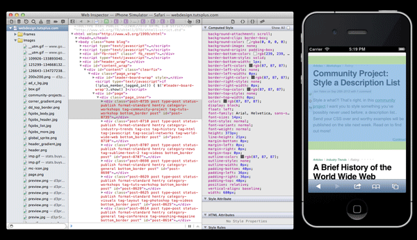

# 
 Web Inspector

## 
¿Qué es Web Inspector?

Web Inspector es una herramienta de desarrollo web que permite a los desarrolladores inspeccionar, depurar y analizar el código fuente de la página web en tiempo real. Mediante de una interfaz gráfica que facilita la identificación de problemas.

## 
¿Quién lo hizo?

Web Inspector fue desarrollado por Apple Inc.   Principalmente fue para el navegador web Safari. Fue diseñado para ayudar a los desarrolladores.

## 
¿Cómo se hizo?

Web Inspector se creo utilizando los siguientes lenguajes de programación: HTML,CSS y JavaScript.

## 
¿Dónde se hizo?

El desarrollo de Web Inspector se llevó a cabo en las instalaciones de Apple Inc, principalmente en Cupertino, California, donde se encuentra la sede de la empresa.

## 
¿Cuándo se hizo?

Web Inspector se introdujo por primera vez en Safari en 2007, cuando Apple lanzó Safari 3 como parte de Mac OS X 10.5 Leopard.

---

### Información básica sobre Web Inspector

| Aspecto           | Detalle                          |
|-------------------|----------------------------------|
| Desarrollador     | Apple Inc.                       |
| Lanzamiento       | 2007                             |
| Tecnologías       | HTML, CSS, JavaScript             |

---

Ejemplo de Web Inspector 

---

[Explicación de Web Inspector](https://www.youtube.com/watch?v=4gnxf9LFpC0&ab_channel=CodinginPublic)
